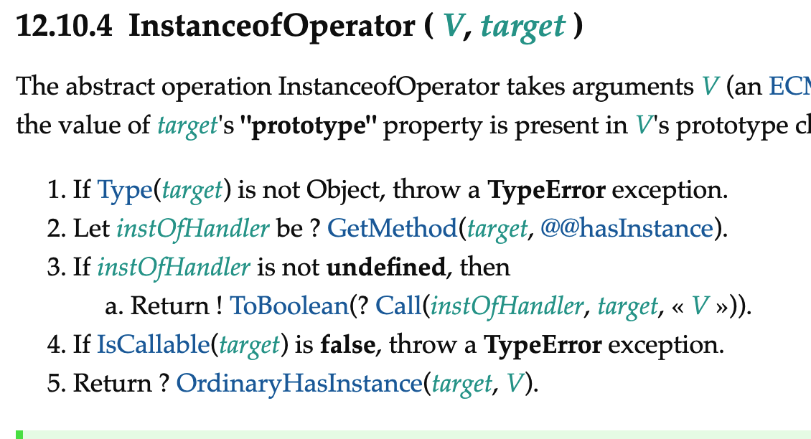
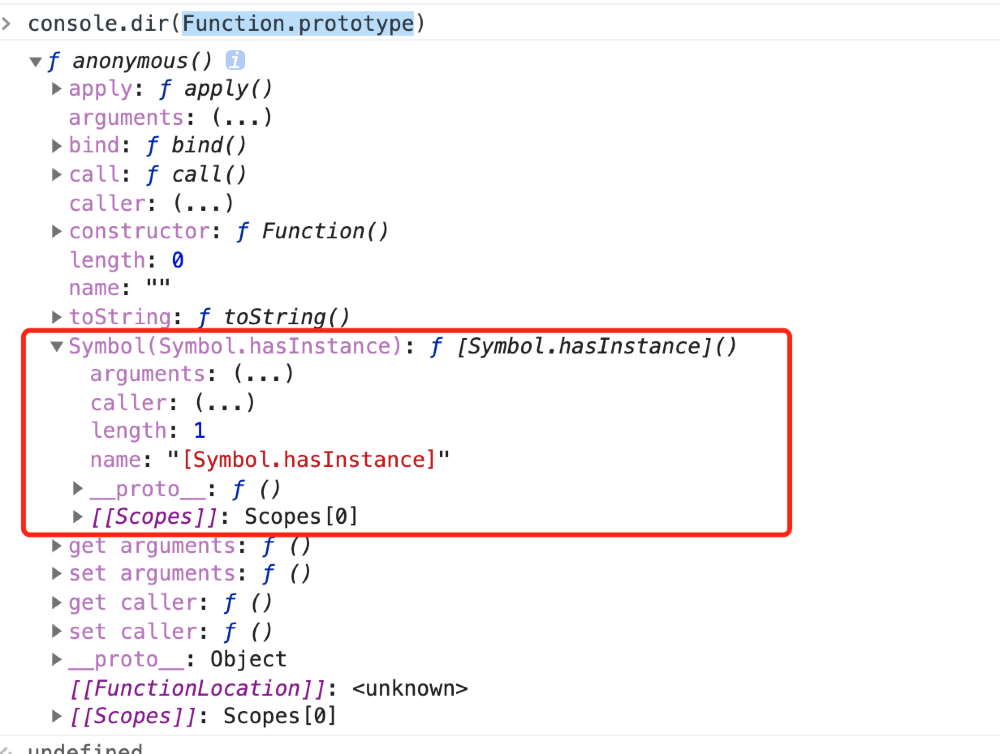
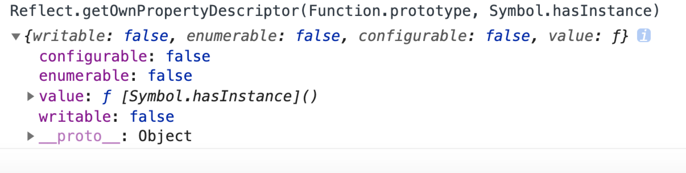

# instanceof

```javascript
a instanceof A;
```

以上面为例 instanceof 关键的一步就是，

- 判断`a.__proto__ === A.prototype`,如果相等返回`true`;
- 如果不等,沿着原型链继续层层查找对比`a.__proto__.__proto__.....__proto__ === A.prototype`
- 如果中间某一级相等则返回`true`,如果原型链一直到`null`则返回`false`

## 简版实现
根据以上步骤我们可以实现一个简版的`myInstanceof`
```javascript
const myInstanceof = (a, A) => {
  const P = A.prototype;
  const t = a.__proto__;
  while (true) {
    if (t === null) return false;
    if (t === P) return true;
    t = t.__proto__;
  }
};
```
## 查缺补漏
[ecma](https://tc39.es/ecma262/#sec-instanceofoperator)定义中其实还有非常关键的一步

其中第2，3步,表明了如果`target`(V instanceof target)上拥有`@@hasInstance`,
则会赋值给`instOfHandler`，然后调用`instOfHandler`, 返回函数结果的逻辑值
注：`@@hasInstance`其实就是`Symbol.hasInstance`,故这是es5里面不存在的
## 真实场景
- case1
```javascript
const a = {};
const A = {};
const hasInstance = () => true;

a instanceof A; // Uncaught TypeError: Right-hand side of 'instanceof'

A[Symbol.hasInstance] = hasInstance;
a instanceof A; // true
A[Symbol.hasInstance] === hasInstance; // true
A[Symbol.hasInstance]; // () => true

```

- case2
```javascript
const a = {};
const A = function() {};
const hasInstance = () => true;

a instanceof A; // false

A[Symbol.hasInstance] = hasInstance;
a instanceof A; // false
A[Symbol.hasInstance] === hasInstance; // false
A[Symbol.hasInstance]; // ƒ [Symbol.hasInstance]() { [native code] }
```
两个版本之所以出现不一样的结果是因为，在最近标准下，函数默认会带有`@@hasInstance`方法，

并且是不可以覆写的



## 最终版本
注:这里依然没有实现标准所有的步骤，比如判断函数，以及获取`bind`后函数的原始函数等，但是这不影响最主要的功能
```

```

